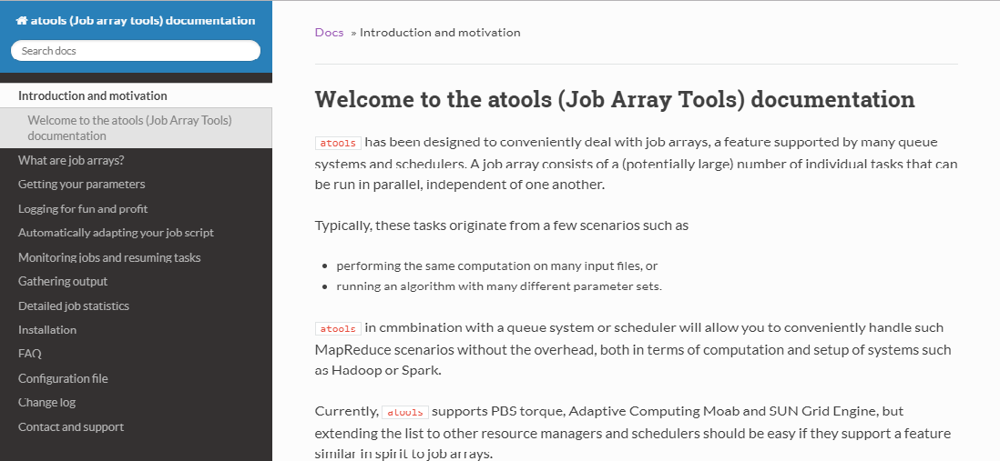

# MkDocs

[MkDocs](https://www.mkdocs.org/) complements Doxygen nicely, since it is very useful for tutorial-style documentation.  The format is MarkDown, a very simple text mark-up format that is ubiquitous nowadays.  It is used in many online tools such as blogging software, but also in development tools such as GitHub and Jupyter notebooks.

## initialisation

Suppose we have a project in a directory `my_project` that has a source directory and some files.  Initially, the directory looks like this.

~~~~
my_project/
└── src
    ├── bye.c
    ├── hello.c
    └── Makefile
~~~~

When you want to start to document this project, you can set it up using MkDocs' `new` command, e.g.,

~~~~bash
$ mkdocs new my_project
~~~~

The directory will now look as follows:

~~~~
my_project/
├── docs
│   └── index.md
├── mkdocs.yml
└── src
    ├── bye.c
    ├── hello.c
    └── Makefile
~~~~

A configuration file `mkdocs.yml` has been created, as well as a `docs` directory that will contain the MarkDown pages with the documentation, and an `index.md` file in that directory that serves as the entry point into your documentation.


## Configuration file

The configuration file is in YAML format, and initially looks as follows:

~~~~
site_name: My Docs
~~~~

This will have to be customised to your requirements.  The site name can be changed to, e.g., the name of your project.  Several other meta-data items can be added, e.g.,

~~~~
site_name: my_project documentation
site_description: this is a project that implements some brilliant software.
site_author: Geert Jan Bex
theme: readthedocs
~~~~

You also have to specify where to create the documentation, e.g., in a subdirectory `html_docs` of `my_project` directory.

~~~~
site_name: my_project documentation
site_description: this is a project that implements some brilliant software.
site_author: Geert Jan Bex
theme: readthedocs
site_dir: html_docs/worker
~~~~

Lastly, you can specify the titles of the pages of your documentation, and the MarkDown files.

~~~~
site_name: my_project documentation
site_description: this is a project that implements some brilliant software.
site_author: Geert Jan Bex
theme: readthedocs
site_dir: html_docs/worker
pages:
- Introduction and motivation: 'index.md'
- Step by step: 'steps.md'
~~~~

Of course the `index.md` file should be edited, and the `steps.md` file created.


## Documentation pages: MarkDown

Individual pages are written as MarkDown text.  Below is an example for `steps.md`.

~~~~markdown
  ## High-level description
  This project supports a workflow in several steps.

    1. First you say hello,
    1. then you say bye.

  ## Usage
  There are two applications to achieve this, `hello` and `bye` respectively.  You can call `hello` as

  ```bash
  $ hello gjb
  ```
  Here, `gjb` is the name of the person you want to say hello to.

  _Caution:_ if you use a name that doesn't exists, you will get an error.
~~~~

As you can see, it is almost a normal text, with some special annotation to define style elements. For instance,
  * `# Heading 1`
  * `## Heading 2`
  * `### Heading 3`
  * …
produce headings at various levels. Unordered lists can be created by using a two-spaced indentation, followed by `*` for each item, e.g.,

~~~~
  * First item
  * Second item
~~~~

Similarly, an ordered list can be created as follows,

~~~~
  1. First item
  1. Second item
~~~~

Note that the numbering is automatically done for you, so reordering items is no issue.

Text can have styles such as
  * _emphasized_: `_emphasized_`
  * __bold__: `__bold__`
  * ~~strike-through~~: `~~strike-through~~`
  * `code`: ` `code` `

Code snippets can be rendered with syntax highlighting as

~~~~
  ```fortran
  IF (a < b) THEN
      a = a - b
  END IF
  ```
~~~~

Hyperlinks can be added as `[text](url)`.

Incidentally, this text has been written in MarkDown as well.


## Rendering documentation

Once you are done, you can build the documentation by executing

~~~~bash
$ mkdocs build
~~~~

A very nice feature of MkDocs is that it can offer a live preview of your work in progress, which will shorten your turn-around time while writing documentation.  It contains a web server that runs locally, and that you can point your browser to.

~~~~bash
$ mkdocs serve
INFO    -  Building documentation...
[I 180820 14:52:04 server:271] Serving on http://127.0.0.1:8000
[I 180820 14:52:04 handlers:58] Start watching changes
~~~~

You can view the documentation by entering the URL `http://127.0.0.1:8000` in your web browser.  When you edit the documentation, the pages in your web browser are automatically updated.

The main page of MkDocs generated [documentation for atools](https://atools.readthedocs.io/en/latest/) looks like this.


